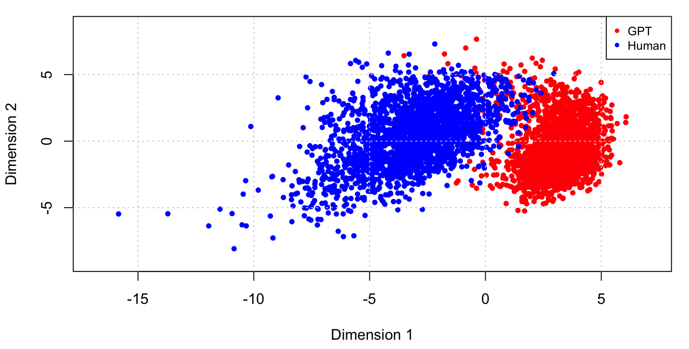

# Stylometric detection of AI-generated texts

Code and data for

> Chen, R., Xiong, S., He, J., & Ross, G. J. (2026). **Stylometric detection of AI-generated texts: evidence from human and machine-written essays.** *Digital Scholarship in the Humanities*, Oxford University Press. https://doi.org/10.1093/llc/fqag064 (open access)

**TL;DR.** On 4,346 topic-paired essays (2,173 human essays from Aeon, 2,173 written by GPT-4o-mini from the same titles, 110 subject areas), a Random Forest on the proportions of **70 function words** separates human from machine writing with **>98% accuracy** — no neural embeddings, fully interpretable. Four studies probe when that holds: how human authorship is represented, how long the text is, how much training data there is, and whether the topic was seen in training. AI text is stylistically *uniform*; human text is *variable* — and that gap is what the classifiers find.

<p align="center"></p>

## Results at a glance

| Study | Question | Finding |
|---|---|---|
| 1 — Authorship representation | Treat all human essays as one class, or each essay as its own author? | Individual authorship lifts every classifier; Burrows' Delta goes from ~65% to ~97% accuracy. |
| 2 — Essay length | Full essays vs. the first 200 words | RF precision collapses to ~0.5 on short texts (false positives); SVMs stay ~0.9 and are the robust choice for short inputs. |
| 3 — Training-set size | 100 / 50 / 20 / 10% of training data | RF keeps 98.4% accuracy at 10%; SVM falls to ~75%; Delta is in between. |
| 4 — Topic transfer | Same topic / one unrelated topic / all other topics | RF ≈99% in every scenario; SVM 70% → 99% once training spans diverse topics; Delta drops to 66% on an unrelated topic. |

Table 2 of the paper summarises the trade-offs: **RF** for general-purpose detection and scarce data, **SVM** for short texts and large diverse corpora, **Burrows' Delta** when interpretability matters and topics are matched.

## What's in the repository

```
code/
  python/extract_function_words.py   essays -> 71-dim function-word count vectors (argparse CLI)
  R/00_setup.R                       packages, helper functions, load both corpora  <- run first
  R/stylometryfunctions.R            corpus loading, Burrows' Delta, RF, SVM, cross-validation helpers
  R/reducewords.R                    resample a count vector down to N words
  R/study1_authorship_representation.R
  R/study2_essay_length.R
  R/study3_training_size.R
  R/study4a_same_topic.R  study4b_single_other_topic.R  study4c_all_other_topics.R
  R/svm_parameter_sweep.R            cost/kernel sweep behind the SVM settings
  R/visualization_mds.R              Figure 1
  R/exploratory/                     KNN k-sweep and single-word discriminability (not in the paper)
data/
  function_words.txt                 the 70 function words, in feature order
  function_words/{human,gpt}/<topic>/  one count vector per essay (2 x 2,173)
  gpt_essays/<topic>/                full text of the generated essays (2,173)
  titles.csv                         topic / file / title for every pair
  README.md                          data provenance, how to rebuild the human side
results/
  figures/                           plots used in the paper and appendix
  tables/                            per-scenario metrics (xlsx)
```

The human essays' text is **not** redistributed (Aeon copyright); the derived feature vectors are, and they are all the studies need. See `data/README.md`.

## Method in one paragraph

Each essay is reduced to a 71-dimensional vector: counts of 70 high-frequency function words (the Mosteller–Wallace list — *a, all, also, an, and, …*) plus the count of everything else; proportions are used downstream. Three classifiers are compared with the same features and leave-one-out cross-validation: **Burrows' Delta** (nearest class centroid in standardised function-word space), an **RBF-kernel SVM**, and a **Random Forest**, reported as accuracy, precision, recall and F1 with "AI" as the positive class. The corpus is balanced by construction: for every Aeon essay, GPT-4o-mini was asked to write a 1000-word essay from the same title, which isolates stylistic from topical differences.

## Reproduce

Requirements: R ≥ 4.1 with `caret`, `randomForest`, `e1071`, `class`, `writexl`; Python ≥ 3.9 (standard library only).

```r
# from the repository root
source("code/R/00_setup.R")                        # loads HumanCorpus / GPTCorpus
source("code/R/visualization_mds.R")               # Figure 1
source("code/R/study1_authorship_representation.R")
source("code/R/study3_training_size.R")
source("code/R/study4a_same_topic.R"); source("code/R/study4b_single_other_topic.R"); source("code/R/study4c_all_other_topics.R")
```

Study 2 needs 200-word features. Regenerate them from the essays (GPT essays are included; human essays per `data/README.md`):

```sh
python3 code/python/extract_function_words.py --input data/gpt_essays --output data/function_words_200/gpt --max-words 200
python3 code/python/extract_function_words.py --input <human_essays_dir> --output data/function_words_200/human --max-words 200
```
then `source("code/R/study2_essay_length.R")`. Metric tables are written to `results/tables/`.

The Python extractor was rewritten for release; on the included GPT essays it reproduces the published feature files (all 70 function-word counts identical on every file checked; the residual "other words" count differed by two in one file, a tokenisation edge case with no effect on the models).

## Limitations and follow-up

The paper's limitations section is candid: one generator (GPT-4o-mini), one prompt, one genre (long-form essays), function words only, no hybrid human–AI texts. Work in progress extends the baseline to character n-grams and embeddings, other generators (Claude, Gemini), hybrid texts, and tuned hyper-parameters; results will be added here.

## Credits and licence

Analysis, data pipeline and the four studies: Rongzhi Chen, with Shizhao Xiong and Jingqi He (University of Edinburgh). `stylometryfunctions.R` and `reducewords.R` are course materials by Gordon J. Ross, included with permission. The project began as a case study in the School of Mathematics, University of Edinburgh, and was developed into the published paper.

Code: MIT (see `LICENSE`). GPT-generated essays and derived features: released for research use under the same terms. Human essays: © Aeon Media, not included.

## Citation

```bibtex
@article{chen2026stylometric,
  title   = {Stylometric detection of {AI}-generated texts: evidence from human and machine-written essays},
  author  = {Chen, Rongzhi and Xiong, Shizhao and He, Jingqi and Ross, Gordon J.},
  journal = {Digital Scholarship in the Humanities},
  year    = {2026},
  publisher = {Oxford University Press},
  doi     = {10.1093/llc/fqag064}
}
```
